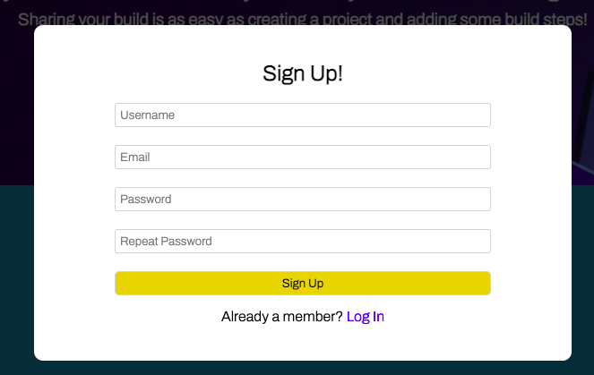
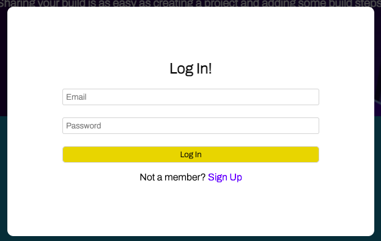
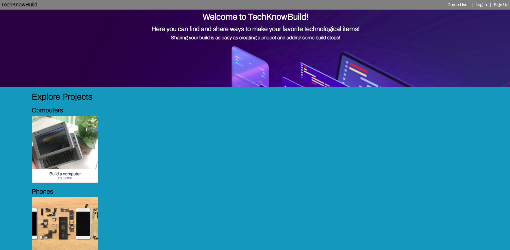
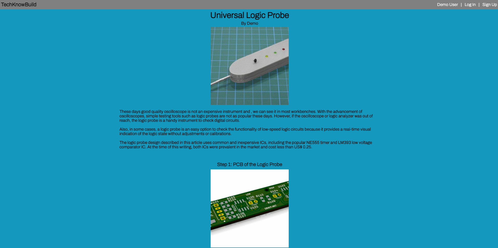
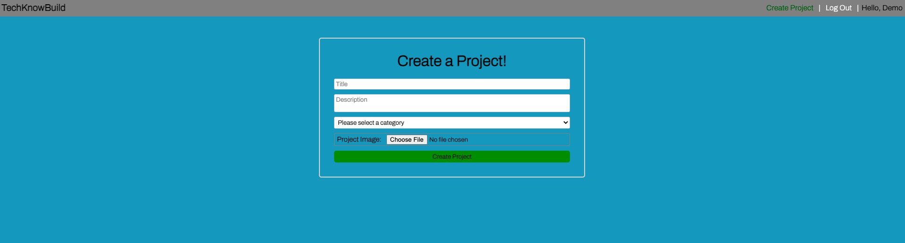
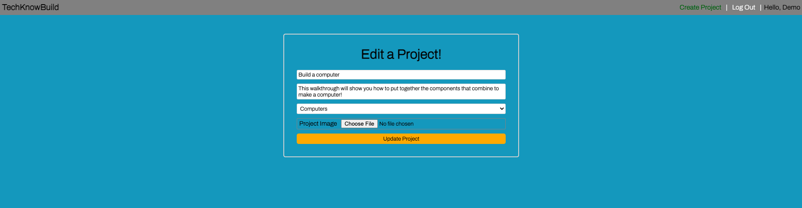
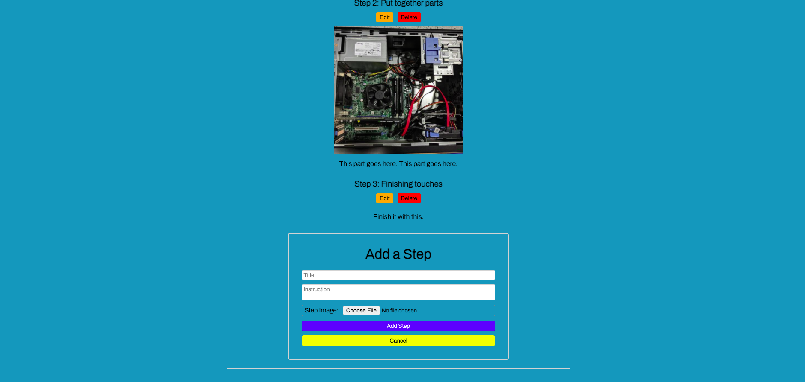
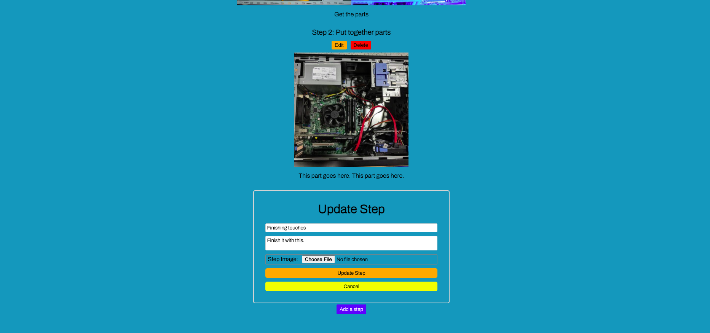
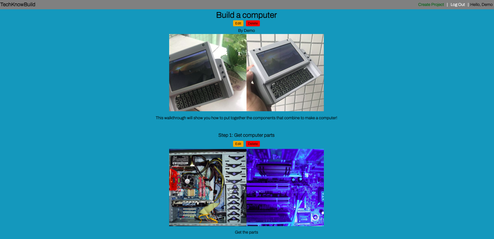

# TechKnowBuild

TechKnowBuild is an Instructables clone for people to find, share, and comment on instructions for how to build different technological items, such as computers, phones, tablets, and even their components like microchips. It is a fullstack React App made with a Redux state manager and a backend using Python, Flask, SQL-Alchemy, PostgresSQL and other technologies.

-   View the <a href='https://techknowbuild.herokuapp.com/'>TechKnowBuild</a> App Live

-   Reference to the TechKnowBuild <a href='https://www.github.com/jujmart/TechKnowBuild/wiki'>Wiki Docs</a>

| Table of Contents                                                        |
| ------------------------------------------------------------------------ |
| 1. [Features](#features)                                                 |
| 2. [Installation](#installation)                                         |
| 3. [Technical Implementation Details](#technical-implementation-details) |
| 4. [Future Features](#future-features)                                   |
| 5. [Contact](#contact)                                                   |
| 6. [Special Thanks](#special-thanks)                                     |

## Technologies

-   <a href="https://developer.mozilla.org/en-US/docs/Web/JavaScript"></a>
-   <a href="https://www.postgresql.org/"></a>
-   <a href="https://nodejs.org/"></a>
-   <a href="https://reactjs.org/"></a>
-   <a href="https://redux.js.org/"></a>
-   <a href="https://developer.mozilla.org/en-US/docs/Web/CSS"></a>
-   <a href="https://www.python.org/"></a>
-   <a href="https://flask.palletsprojects.com/"></a>
-   <a href="https://www.heroku.com/home"></a>
-   <a href="https://alembic.sqlalchemy.org/">Alembic</a>
-   <a href="https://s3.console.aws.amazon.com/s3/home?region=us-east-2">S3 Amazon Web Services API</a>

## Features

### Log In and Sign Up




### Home

The TechKnowBuild home page displays all projects by category


### View Project and Steps

View of single project title, photos, description, and associated steps


### Create Project

Add a new project to the site


### Edit Project

Edit a project on the site


### Create Step

Create a step on the site


### Edit Step

Edit a step on the site


### Delete Project/Step

Delete a project or step on the site using the associated buttons


## Installation

To build/run project locally, please follow these steps:

1. Clone this repository

```shell
git clone https://github.com/jujmart/TechKnowBuild.git
```

2. Install Pipfile dependencies and create the virtual environment

```shell
pipenv install
```

2. Install npm dependencies for the `/react-app`

```shell
cd react-app
npm install
```

3. In the `/` root directory, create a `.env` based on the `.env.example` with proper settings

4. Setup your PostgreSQL user, password and database and ensure it matches your `.env` file

5. Before running any flask commands, confirm you are in the pipenv virtual env. If not, run the command:

```shell
pipenv shell
```

6. In the root folder, migrate tables to the database by running in the terminal:

```shell
flask db upgrade
```

7. In the root folder, seed the database by running in the terminal:

```shell
flask seed all
```

8. Start the flask backend in the `/` root directory

```shell
flask run
```

9. Start the frontend in the `/react-app` directory

```shell
npm start
```

## Technical Implementation Details

### {Detail 1}

Description 1

Part of code is shown below:

```python
print('add code snippet 1 here')
```

Description 2

```javascript
print("add code snippet 2 here");
```

### {Detail 2}

Description 1

Code snippet is shown here:

```javascript
print("add code snippet 1 here");
```

## Future Features

1. **Search** - search through project titles to find the desired tech build

2. **Youtube API** - project creators can house and show youtube videos on the site to give additional support to a project or step

3. **Multiple File Upload** - project creators can add more than one image or video as support for their project or step

## Contact

### Justice Martin

<a href="https://www.linkedin.com/in/justice-martin-34043340/"></a>
<a href="https://github.com/jujmart"></a>

jujmart12@gmail.com

## Special Thanks

-   Fellow peers who have given me support and community: [Andrew](https://github.com/andru17urdna), [Henry](https://github.com/hnrywltn), [Pierre](https://github.com/TheGuilbotine), [Lema](https://github.com/lemlooma), [Meagan](https://github.com/meagan13), [Simon](https://github.com/Simonvargas), [Michelle](https://github.com/michellekontoff), [Nico](https://github.com/nicopierson), [John](https://github.com/Jomix-13), [Manna](https://github.com/makon57), [Monte](https://github.com/theflaggship), [Kagen](https://github.com/KagenLH), [Jubin](https://github.com/Jubintgh), [Torrell](https://github.com/tkenned2020), [Irina](https://github.com/IrinaAmzashvili), [Joe](https://github.com/joejunkim), [Diana](https://github.com/dianabeatriztinoco), and [Justice](https://github.com/jujmart)
-   Mentors who have given me their time and effort: [Zach](https://github.com/zdwatts), [Olivia](https://github.com/OByrnes), [Ed](https://github.com/edherm), and [Javier](https://github.com/javiermortiz)
